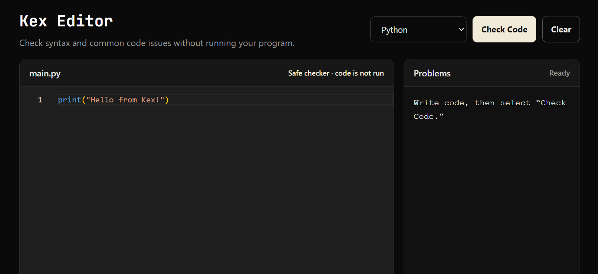
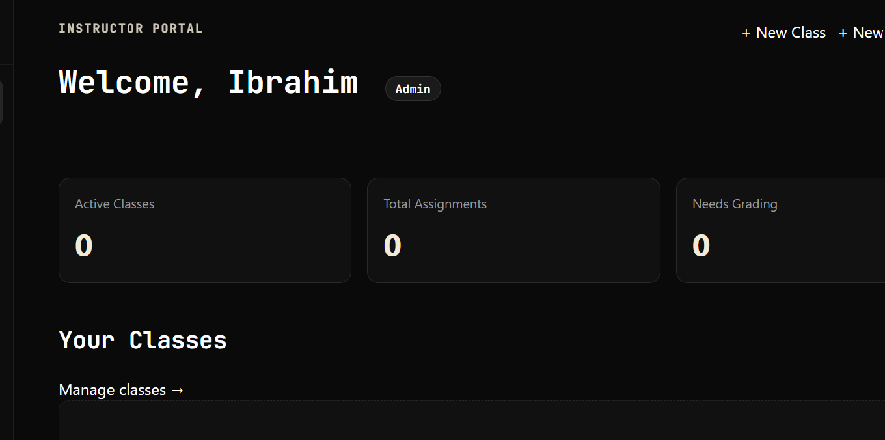
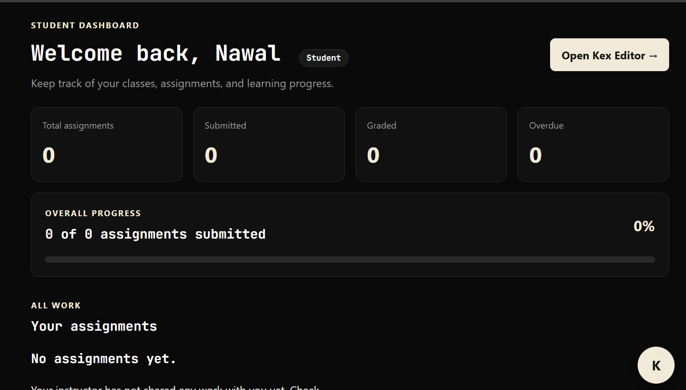
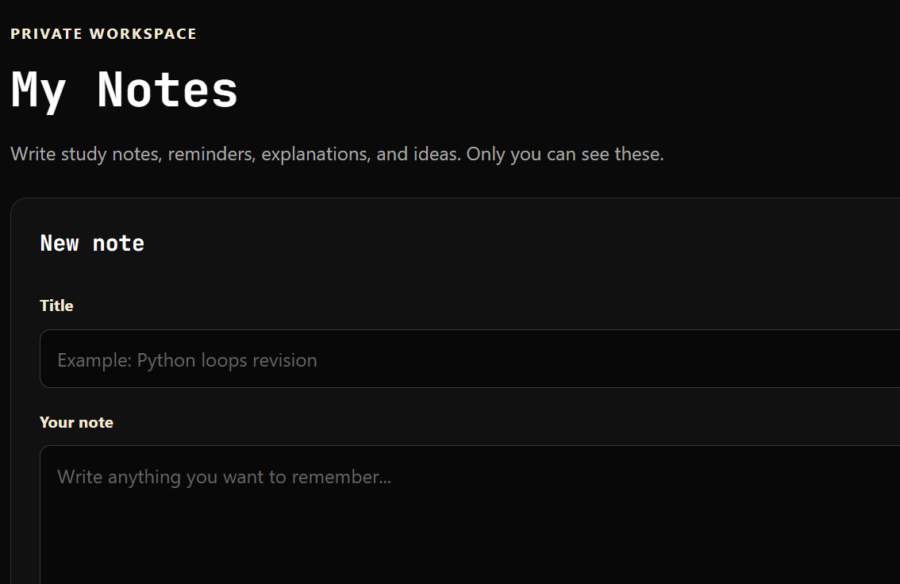
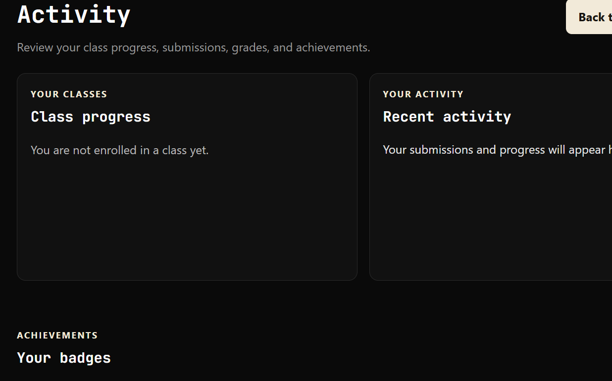
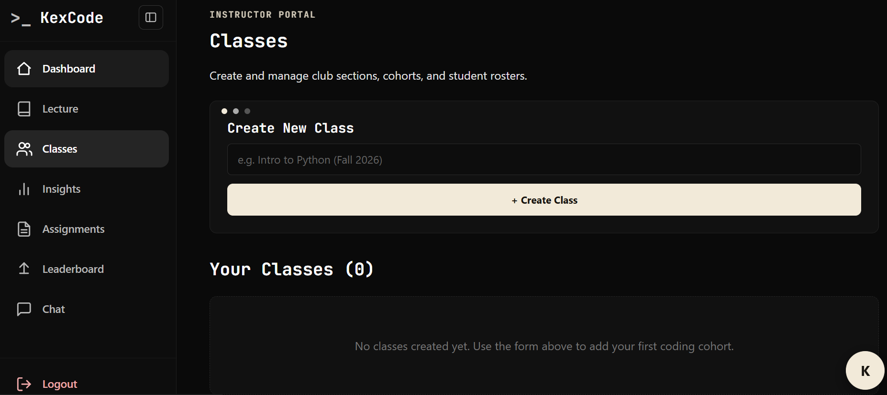
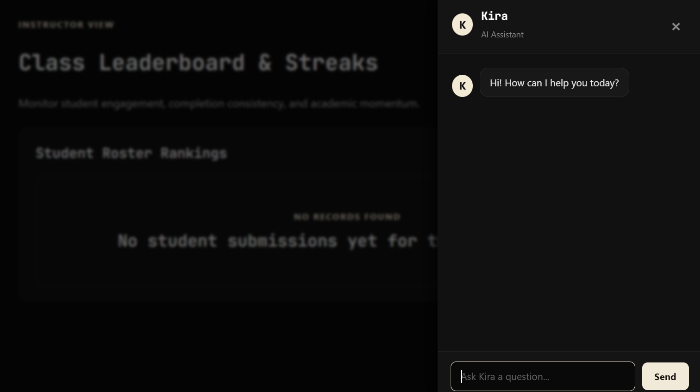

# KexCode

> A lightweight, web-based educational coding workspace and classroom management platform designed for school coding clubs and introductory computer science courses.

#### Video Demo: [Watch on YouTube](https://youtu.be/bBFjT2tkyYY)
#### Live Deployment: [tisalisdev.pythonanywhere.com](https://tisalisdev.pythonanywhere.com)

---

## Overview

**KexCode** bridges the gap between complex industrial IDEs and limited browser sandboxes. Built specifically for school environments without dedicated server execution infrastructure, KexCode provides students with a real Monaco-powered editor, instant browser-side syntax diagnostics, assignment workflows, and an AI tutor ("Kira"). For instructors, it offers full class roster controls, automated submission tracking, deadline enforcement, manual grading suites, and one-click gradebook CSV exports.

The platform follows a clean, high-contrast monochrome aesthetic (black, white, and warm cream) designed to keep students focused on code without unnecessary visual clutter.

---

## Screenshots

<!-- Replace the paths below with your images in docs/screenshots/ when ready -->

| Student Workspace & Editor | Classroom Insights & Grading |
| :---: | :---: |
|  |  |
| *Monaco editor with browser-only checks and Kira AI tutor* | *Instructor submission review, feedback, and scoring* |

| Student Dashboard | Lecture Notes & PDF Hub |
| :---: | :---: |
|  |  |
| *Progress tracking, streaks, and assignment statuses* | *Curated reading materials with downloadable lecture PDFs* |

---

## Core Features

### 🎓 Student Portal
- **Dashboard & Progress Tracking:** Real-time visibility into pending, submitted, graded, and overdue tasks with streak tracking.
- **Monaco Code Editor:** Embedded VS Code editor engine supporting Python, JavaScript, HTML, and CSS with custom tab sizing, syntax highlighting, and shortcuts.
- **Client-Side Diagnostics:** Instant code problem detection and HTML/CSS live preview running safely inside the student's browser without requiring server execution.
- **Autosave & Draft System:** Work is continuously cached and periodically saved to SQLite via `navigator.sendBeacon` and timed background requests so students never lose code.
- **Submission History:** Full chronological record of previous attempts with timestamps, late flags, scores, and instructor feedback.
- **Kira AI Assistant:** Context-aware conversational helper that guides students through logic bugs using Socratic hints instead of giving away full solutions.
- **Personal Notes:** Private notepad for personal reference and problem-solving logs.
- **Lecture Materials:** Access class reading materials and attached lecture PDF handouts.

### 👩‍🏫 Instructor / Admin Portal
- **Class & Roster Management:** Create classes, generate student join codes, view rosters, and track individual student performance.
- **Assignment Builder:** Create, edit, and schedule coding assignments with custom starter code, allowed languages, point values, and strict deadlines.
- **Grading Suite:** Side-by-side submission review with syntax-highlighted student code, submission lateness tags, grade assignment, and written feedback.
- **Lecture Management:** Publish rich-text lecture notes and upload companion PDF handouts for students to study.
- **Classroom Insights & Analytics:** High-level metrics showing class completion percentages, grade averages, and overdue trends.
- **CSV Gradebook Export:** One-click zero-dependency CSV generation exporting comprehensive class rosters, grades, and submission statuses.

---

## Tech Stack & Architecture

- **Backend:** Python 3.10+, Flask
- **Database:** SQLite3 via `cs50.SQL`
- **Frontend:** Jinja2 templates, Semantic HTML5, Vanilla CSS3 (custom responsive design system), Modern JavaScript (ES6+)
- **Code Editor:** Monaco Editor (AMD loader)
- **Authentication:** Werkzeug password hashing, session-based auth, custom role decorators (`@login_required`, `@admin_required`)
- **Email Service:** Python `smtplib` with SSL/STARTTLS and dual HTML/plain-text templates for account verification
- **Deployment:** PythonAnywhere (WSGI configuration)

---

## Project Structure

```text
kexcode/
├── app.py                  # Main Flask application, routing, and business logic
├── helpers.py              # Auth decorators, email dispatch, and helper utilities
├── schema.sql              # Relational database schema and table definitions
├── kexcode.db              # SQLite database (generated locally)
├── requirements.txt        # Python package dependencies
├── .env.example            # Template for environment configuration
├── static/
│   ├── favicon.svg         # Platform branding icon
│   ├── styles.css          # Unified monochrome design system
│   ├── js/                 # Client scripts (editor setup, autosave, Kira drawer)
│   └── uploads/
│       └── lectures/       # Storage directory for uploaded lecture PDFs
└── templates/
    ├── layout.html         # Base template with responsive sidebar and Kira modal
    ├── login.html          # Centered authentication page
    ├── register.html       # Student/Admin registration with email verification
    ├── dashboard.html      # Student home view
    ├── assignments.html    # Student assignment list
    ├── assignment_detail.html # Monaco editor workspace
    ├── submissions.html    # Submission history and instructor feedback
    ├── notes.html          # Lecture directory
    ├── note_detail.html    # Lecture viewer with PDF download
    ├── my_notes.html       # Private student notepad
    ├── admin_classes.html  # Instructor roster and class manager
    ├── admin_grading.html  # Submission grading interface
    ├── admin_notes.html    # Lecture creation and PDF upload form
    └── admin_insights.html # Class analytics and CSV export
```

## Getting Started (Local Setup)

# Prerequisites
```
Python 3.10 or higher

Git
```

1. Clone the repository
```
git clone https://github.com/imtisal-zainab-hashmi/KexCode.git
cd KexCode/kexcode
```

2. Create and activate a virtual environment

macOS / Linux:
```
python3 -m venv venv
source venv/bin/activate
```
Windows (PowerShell):
```
python -m venv venv
.\venv\Scripts\Activate.ps1
```

3. Install dependencies
```
pip install -r requirements.txt
```

4. Configure environment variables
```
Create a .env file in the project root:

SECRET_KEY=your-random-secret-key
EMAIL_ADDRESS=your_email@gmail.com
EMAIL_PASSWORD=your_gmail_app_password
MAIL_SERVER=smtp.gmail.com
MAIL_PORT=465
OPENAI_API_KEY=your_openai_or_openrouter_api_key
```

5. Initialize the database
```
sqlite3 kexcode.db < schema.sql
```

6. Run the application
```
flask run --debug
```
```
Open http://127.0.0.1:5000 in your browser.
```

---

## Screenshots

|  |  |

|  |

---
## License
This project is licensed under the MIT License — see the LICENSE file for details.

